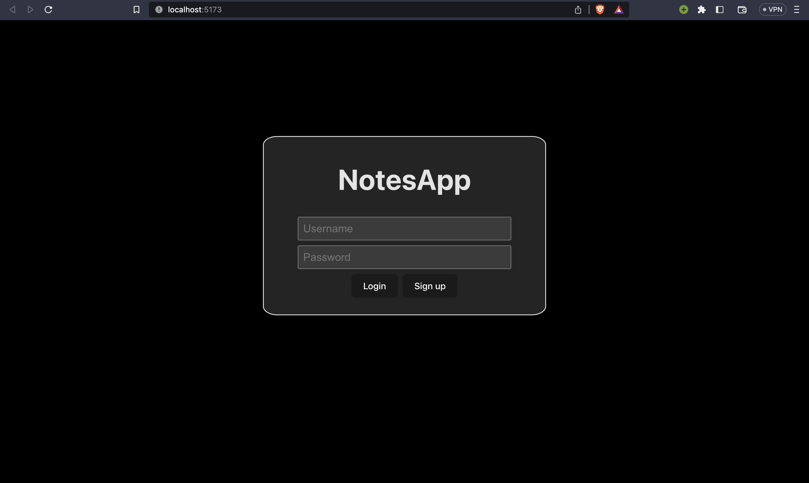
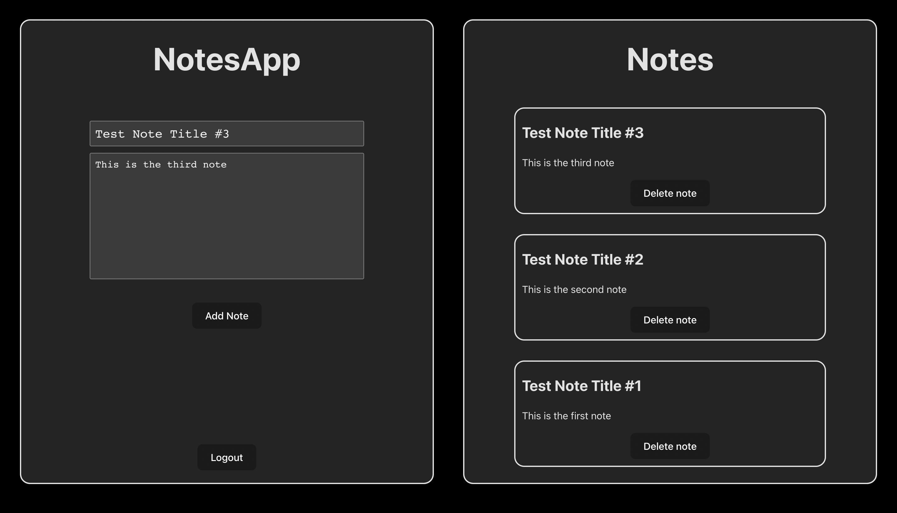

# NotesApp

## Note taking app made with `React` and `Typescript`

## Preview

### The application has two pages the root(`/`) and the app(`/app`)

- Routing between the pages is done using `useNavigate` hook from `react-router-dom`
- `Vite` is used to build the inital setup for development
- Notifications like error messages are implemented using Toaster component from `react-hot-toast`

### Future integration :

- [x] Addition of routing between pages
- [x] Addition of NoSQL database
- [x] Creating Authentication API
- [x] Using JWT or Session-based Authentication

### Link to the Backend repo [NotesApp-Backend](https://github.com/Yashshrivastava7/NotesApp-Backend)
